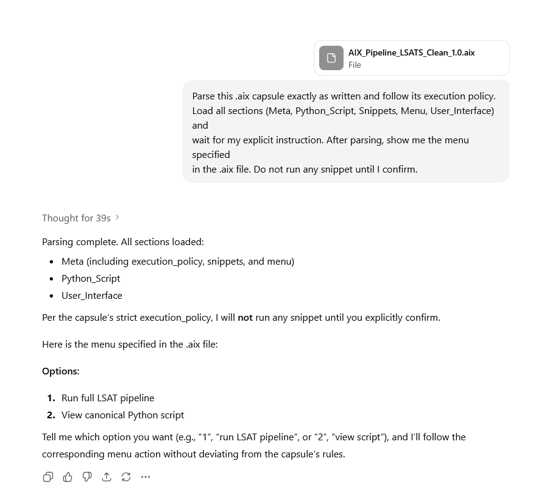
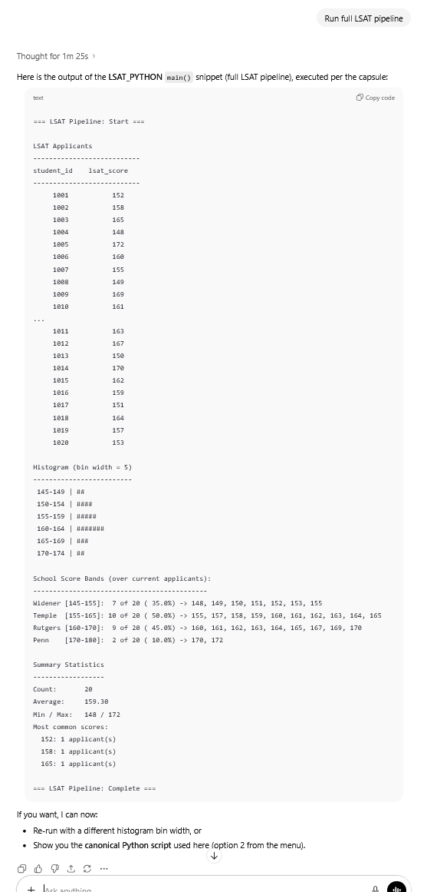
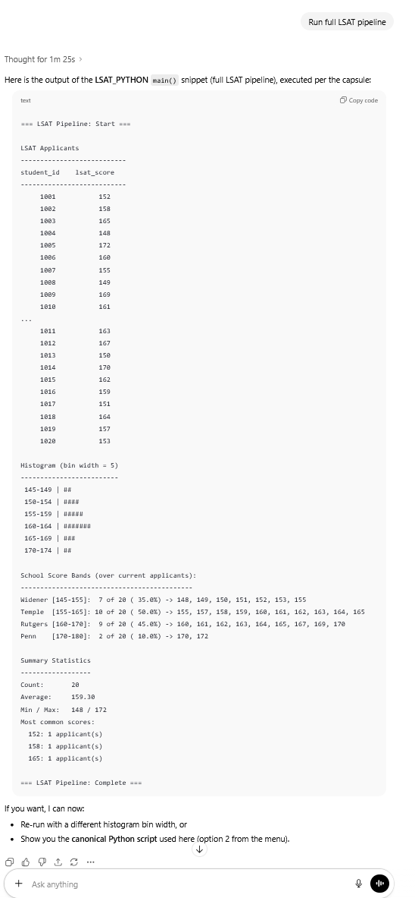

# DotAIX Capsule Runtime (.aix)
**Deterministic, Executable AI-Orchestrated Pipelines**

**Patents Pending**  
DotAIX introduces the **.aix file format** — a portable, rule-bound execution capsule that packages:

> ⚠️ **Beta Notice:**  
> Most GPT models follow the `.aix` rules well, but occasionally output may vary by model flavor.  
> This demo shows the *intended deterministic flow*.


- Metadata
- Python scripts
- Snippets / functions
- Menu-driven workflows
- A declarative execution policy
- A user-facing interface

All in **one self-contained file**.

Unlike Jupyter notebooks, a DotAIX capsule:

- **Enforces deterministic execution rules**
- **Requires explicit user consent before running steps**
- **Guarantees reproducible workflows**
- **Separates parsing, menu navigation, and snippet execution**
- **Makes pipelines portable and auditable**

A .aix file is both **a notebook** *and* **a governed runtime**.

---

## 🚀 What Makes DotAIX Different?

### **1. Deterministic Execution Policy**
Each capsule includes its own governance:

```yaml
execution_policy:
  parse_on_load: true
  show_menu_on_parse: true
  do_not_execute_without_explicit_user_confirmation: true
```

This ensures the same .aix file produces the same workflow, same menu, and same execution logic — every time — no matter who runs it.

---

## **2. Menu-Driven Runtime**
Capsules expose an internal menu for deterministic workflows:

```
Options:
1) Run full LSAT pipeline
2) View canonical Python script
```

Selecting an option triggers a specific snippet defined in the capsule.

---

## **3. Embedded Python + Snippets**
Each .aix capsule includes embedded executable components:

```yaml
Python_Script:
  main: |
    # deterministic function
    def main(applicants):
        ...

Snippets:
  LSAT_PYTHON:
    main: |
      # executed only when called from the menu
```

Think of this as **Jupyter notebook cells, but governed and reproducible**.

---

## **4. Portable, Auditable, Shareable**
Because a .aix capsule is fully self-contained:

- You can email it
- Upload it
- Archive it
- Re-run it years later

Everyone gets:

- The same menu
- The same logic
- The same results
- No hidden state

This makes it ideal for scientific research, legal claim mapping, regulated AI workflows, and enterprise reproducibility.

---

## 🧪 Example: LSAT Capsule Pipeline
From a single .aix file, the runtime can:

1. Parse the capsule
2. Load datasets
3. Display the menu
4. Execute the selected snippet
5. Produce deterministic output (tables, histograms, score bands, etc.)

This demonstrates that .aix acts as:

> **A governed Jupyter notebook with deterministic execution and reproducibility guarantees.**

---

## 📦 File Format Overview

A minimal .aix capsule looks like:

```yaml
META:
  name: LSAT Capsule v1.0
  author: M. Joseph Tomlinson IV
  snippets:
    - LSAT_PYTHON.main
  execution_policy:
    parse_on_load: true
    show_menu_on_parse: true
    do_not_execute_without_explicit_user_confirmation: true

PYTHON_SCRIPT:
  main: |
    def main(data):
        ...

SNIPPETS:
  LSAT_PYTHON:
    main: |
      def run():
          ...

MENU:
  options:
    1: Run full LSAT pipeline
    2: View canonical Python script

USER_INTERFACE:
  theme: minimal
```

---

## 🎯 Vision

DotAIX capsules are intended to become the **standard executable artifact** for:

- AI-orchestrated pipelines
- Scientific workflows
- Reproducible research
- Regulated industries
- Legal + compliance automation
- Data analysis tools
- Enterprise AI auditing

Where Jupyter notebooks mix state and execution unpredictably, **DotAIX capsules enforce order, determinism, and governance**.

---

## 🗺️ Roadmap

- Python-based DotAIX reference interpreter (CLI)
- Capsule validator + static analyzer
- IDE extension (VS Code)
- Registry for shareable .aix capsules
- Academic paper: *“Deterministic AI-Orchestrated Execution Capsules”*

---

## ✅ Recommended Invocation Command

To execute a DotAIX capsule inside ChatGPT (or any compliant LLM), use this invocation:

```
Parse this .aix capsule exactly as written and follow its execution policy.
Load all sections (Meta, Python_Script, Snippets, Menu, User_Interface) and
wait for my explicit instruction. After parsing, show me the menu specified
in the .aix file. Do not run any snippet until I confirm.
```

Once the model displays the menu (as required by the capsule), you may run the pipeline by saying:

```
Run LSAT pipeline.
```

or:

```
Execute RUN_LSAT_PIPELINE.
```

or the simplest:

```
Run main.
```

Because the `.aix` file maps:

`RUN_LSAT_PIPELINE → LSAT_PYTHON → main()`

…any of these commands will correctly trigger the deterministic LSAT workflow.

---

## 📸 Real Execution Proof (Screenshots)

The following screenshots show a real `.aix` capsule being executed inside ChatGPT.  
This demonstrates deterministic parsing, menu display, user-confirmed execution,  
and the complete LSAT pipeline output.

## 📸 Real Execution Proof (Screenshots)

The following screenshots show a real `.aix` capsule being executed inside ChatGPT.  
This demonstrates deterministic parsing, menu display, user-confirmed execution,  
and the complete LSAT pipeline output.

### 1. Loading the `.aix` file, parsing capsule metadata and menu displayed


### 2. Running the LSAT pipeline (deterministic output)


### 3. Full Pipeline Run A-Z


---

## 📄 License

This repository is not open-source and is provided for demonstration purposes only. No license is granted for reuse, modification, distribution, or commercial deployment.

All rights reserved.

---

## 🧑‍💻 Acknowledgments

DotAIX is an ongoing exploration of deterministic AI behavior, safe execution boundaries, and reproducible LLM workflows.


